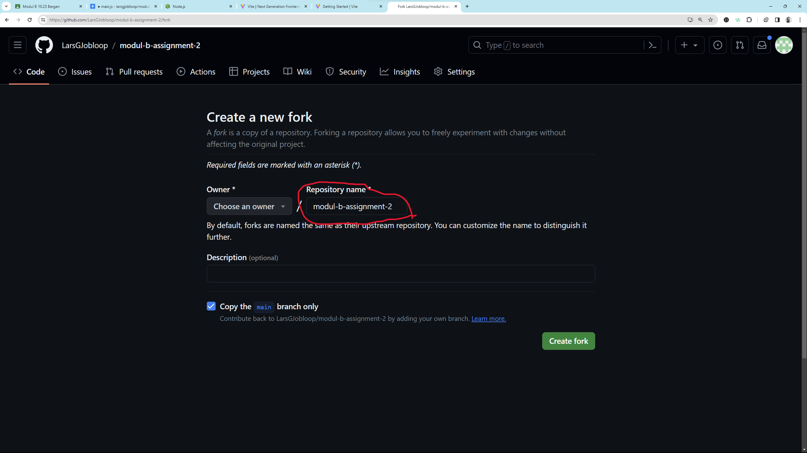
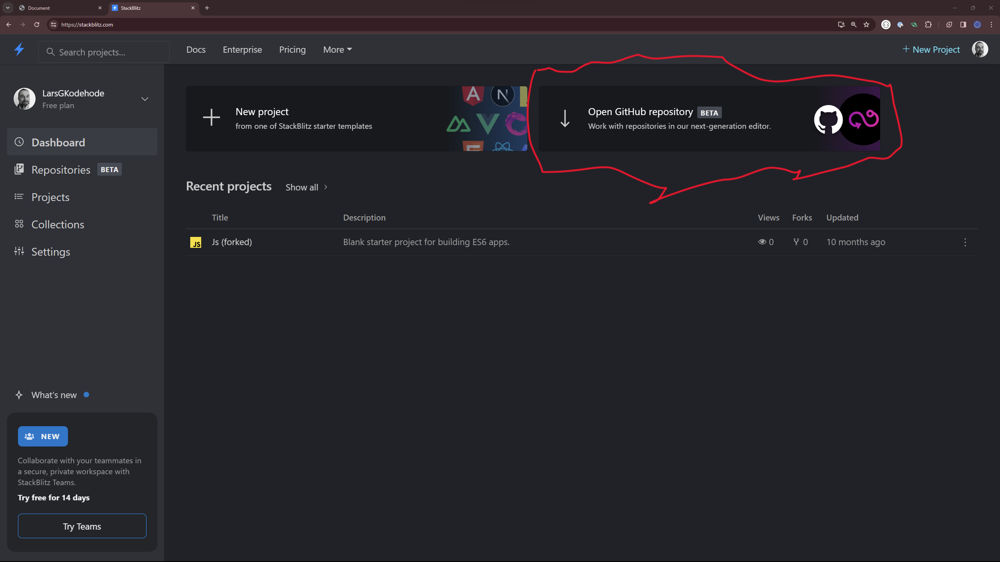
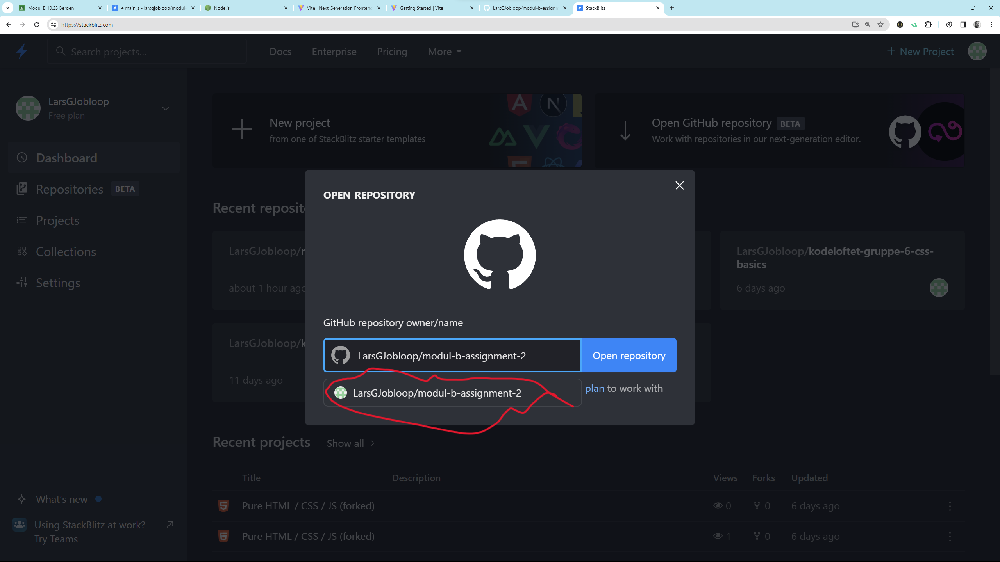

# Task 2

We are trying to include some form of automated assignments testing.
And here is the first part.

To do this you need some software installed on the system you are going to do this assignment, specifically [NodeJS].
Which means you have two options:

1. Make use of a web based (IDE) version of VS Code with the [NodeJS] already installed
2. Install [NodeJS] on your own machine

You will be **required** to use [NodeJS] from Module D to access 3rd party code and libraries like [React]. So no reason to not install it already.

## How to start

### Forking the repository

  1. Create a fork of this repository
      
      

  2. Give it a memorable name
  
      

### Setup
  
  - **Browser IDE**

    3. Create an account on [stackblitz.com](https://stackblitz.com/) using the same GitHub account you created the fork of the project with

    4. Select open a GitHub repository
    
        

    5. Select the forked repository you just created

        

    6. The browser based IDE will take a couple of moment to start and setup everything, but once its finished you should have something fairly similar to VS Code without having to install anything on your own system

  - <details>
    <summary>Local development</summary>

      3. Follow the install instruction her for [NodeJS].
      
      4. Check that [NodeJS] is installed correctly by running the following commands in the terminal.

          ```shell
          node --version # Node Version should be 18.x.x or greater
          ```
          ```shell
          npm --version # Anything but errors here are fine
          ```

      4. Copy the URL address of your own version of the repository

      5. Open VS Code and either use the `Clone Repository` and give it the URL or open the terminal and run `git clone <url-you-copied>` to have a new folder created with the repository content.

      6. Open VS Code in the new folder, we need to run commands from the terminal and those are "aware" of the which folder it's currently in (the Current Working Directory). Run the following command to list out the files so you are sure which folder it's in, it should list all files and directories.

      ```shell
      ls
      # The list needs to contain package.json
      # if not you can use "cd" to change directory
      # or just open VS Code in the correct folder
      ```

      7. Download and install the projects dependencies by running, depending on your internet connection this should not take to long.

      ```shell
      npm install
      ```
  </details>

### Running the tests

Once setup startup the automatic tests by entering
```shell
npm run test
```

The terminal will now output how many of the assignments you have cleared. And will rerun after you have made changes **and saved** them.

**All** the tasks are inside the [main.js](main.js) file, you can safely ignore all the other files for now.

Once you have managed to make all tasks pass, make a final commit and deliver the link to **your fork** of the GitHub repository to [Google Classrom](https://classroom.google.com/).

## Tips

- Make a commit after you have sucessfully made a task pass the tests

## References

- [StackBlitz]
  
  An Web Based IDE, VS Code like in your browser

- [NodeJS]

  A collection of tools and binaries for running JavaScript outside of the browser (on your computer)

- [React]

  A library (a collection of functions) for simplifying modifying and managing HTML & CSS via JavaScript

[StackBlitz]: https://stackblitz.com/
[NodeJS]: https://nodejs.org/en
[React]: https://react.dev/
